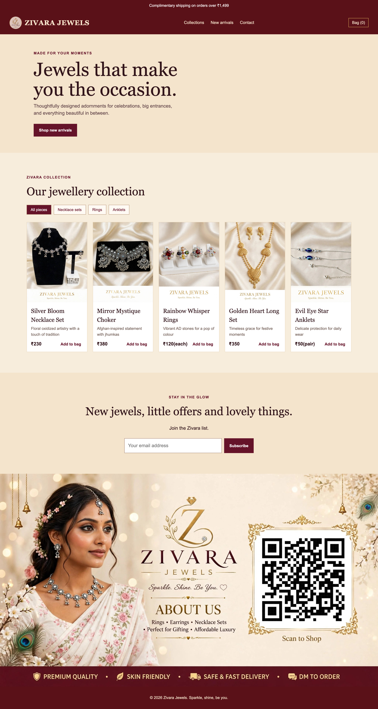

# Zivara Jewels

A responsive React storefront for Zivara Jewels. It includes the supplied campaign artwork, product collection filters, add-to-bag count, and email signup feedback.

## Screenshots

### Desktop



### Mobile


## Requirements

- Node.js 18 or later
- npm

## Run locally

```bash
cd "/Users/riyadebnathdas/Documents/Codex/2026-09-08/us/outputs/zivara-jewels"
npm install
npm run dev
```

Open the local URL printed by Vite, normally `http://localhost:5173`.

## Production build

```bash
npm run build
```

The production-ready files are created in the `dist/` folder.

## Project structure

```text
zivara-jewels/
├── public/assets/       # Logo, campaign artwork, and product images
├── src/main.jsx         # React components and product data
├── src/styles.css       # Responsive styling
├── index.html           # Vite entry page
└── package.json         # Scripts and dependencies
```
